# Reverse Engineering dan Industri Security

Yohanes Nugroho

---
# Saya akan membahas...

Perkenalan apa itu reverse engineering

Berbagai profesi yang berhubungan dengan Reverse Engineering

Contoh melakukan reverse engineering aplikasi mobile

Masa depan Reverse Engineering di era AI

---
# Sebelum membahas masa depan RE

- perlu memahami apa itu RE
- perlu memahami pentingnya RE dalam security
- pelu paham tantangan apa yang ada saat ini

---

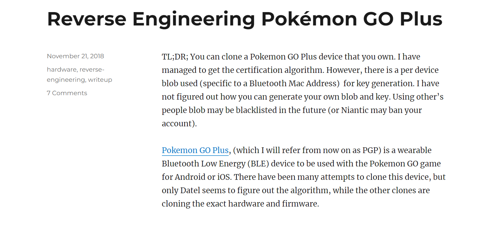

---

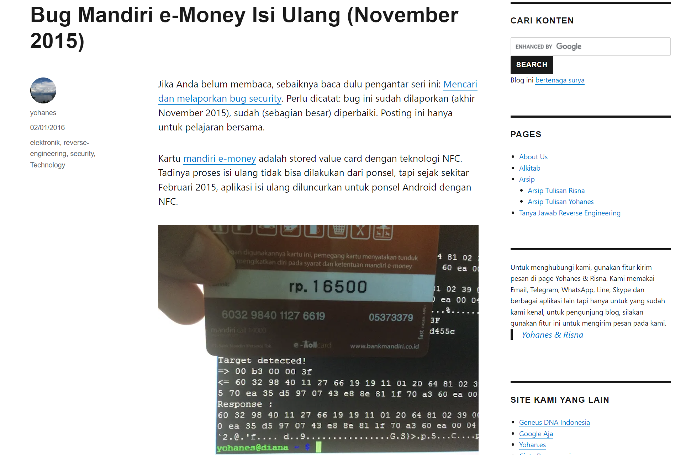

---

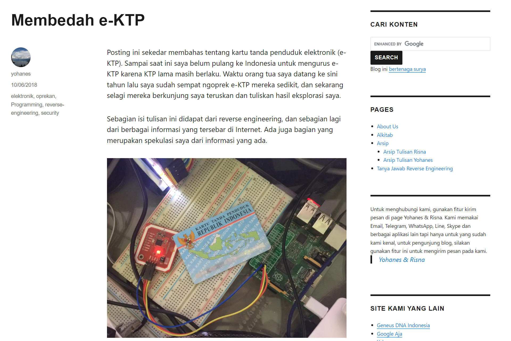

---

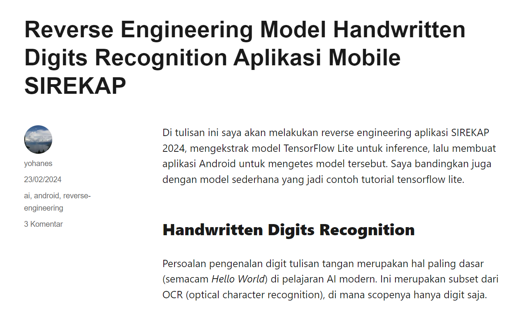


---
# Apa itu reverse engineering?

Memahami suatu hal dengan membongkar hal tersebut:

- Reverse engineering resep masakan
- Reverse engineering design mesin
- Reverse engineering layout PCB
- Reverse engineering kode program

Presentasi ini hanya membahas membongkar kode program

---
# Untuk apa?

- Membongkar malware (untuk berbagai tujuan: forensik, pembuatan anti malware, dsb)
- Mencari bug security
- Memahami algoritma tertentu atau protokol tertentu
- Modifikasi program/game (cheat)
- Mengetahui keamanan sebuah program

---


# RE sangat penting

- Tanpa RE tidak bisa menemukan bug low level
- Tanpa RE tidak bisa membuat exploit low level
- Tanpa RE tidak bisa menganalisis virus, membuat anti malware, decryptor, dsb

---
# RE untuk kejahatan

- Konten WebRIP hasil dari reverse engineering Widevine DRM
- Game dan software bajakan
- Game mod dan cheat (catatan: ada banyak modifikasi yang legal)
- Modifikasi aplikasi misalnya Gojek

---
# Apakah RE software illegal?

Tergantung hukum negara tempat melakukan RE

Biasanya dibolehkan untuk tujuan positif, misalnya interoperabilitas

RE malware merupakan hal yang legal

---
# Pekerjaan RE

- *Saat ini* sulit mencari pekerjaan *legal* yang hanya berfokus pada RE di Indonesia
- Pekerjaan pentest dan forensik kadang berurusan dengan RE, tapi bukan fokus utama
- Pekerjaan RE banyak tersedia di luar negeri (paling dekat: Singapura)
   - Reversing malware
   - Mencari bug di software/hardware IOT

---
# Source code dan Machine code

Source code program dalam bahasa tertentu bisa dijalankan langsung (contoh: JavaScript, Python, dsb)

Untuk efisiensi, biasanya kode program dikompilasi menjadi kode mesin

Walau tujuan utamanya untuk efisiensi, ini mempersulit reverse engineering

---
# Tool
Tool bergantung pada: apa yang ingin direverse engineer

- Aplikasi mobile: apktool, jadx
- Aplikasi desktop: IDA, Binary Ninja, Ghidra
- Device IOT: IDA, binary ninja, ghidra, logic analyzer

Bergantung juga pada proteksi yang ada: butuh debugger atau tool lain

---
# Blackbox RE

Jika kode program tidak tersedia (misalnya ada di remote device, atau di hardware yang diproteksi), maka blackbox RE bisa dilakukan:

- Sekedar mengamati program ketika dijalankan
- Mengubah input dan melihat perubahan output
- Kelemahan: Sulit menemukan hal tersembunyi, misalnya jika program berubah perilakunya para Jumat Kliwon tanggal 13, tidak akan terdeteksi dengan hanya mencoba-coba

---
# Whitebox RE

Jika kode program tersedia, maka cara ini yang dilakukan:

- Memahami program dengan membaca kodenya
- Kadang source code tersedia dan bisa dibaca (contoh: kode Python, PHP) tapi dibuat menjadi rumit (obfuscated)
- Sering kali source code sudah diterjemahkan menjadi bahasa mesin

---
# Mendapatkan program

Kode program desktop mudah dicopy (cukup cari filenya).

Kode program mobile bisa diekstrak dengan mudah untuk versi android, tapi untuk iOS butuh device yang dijailbreak.

Kode malware kadang sifatnya fileless, hanya ada di memori (perlu diekstrak dari memori).

Kode program dalam chip kadang perlu diekstrak dengan hardware tertentu.

---
# Reverse engineering embdded system

- Mengekstrak kode program (kadang sangat mudah, kadang sangat sulit)
- Mengenal dan mendapatkan dokumentasi berbagai chip yang ada di hardware
- Pada dasarnya kembali ke reversing software (firmware yang berjalan pada chip)

---

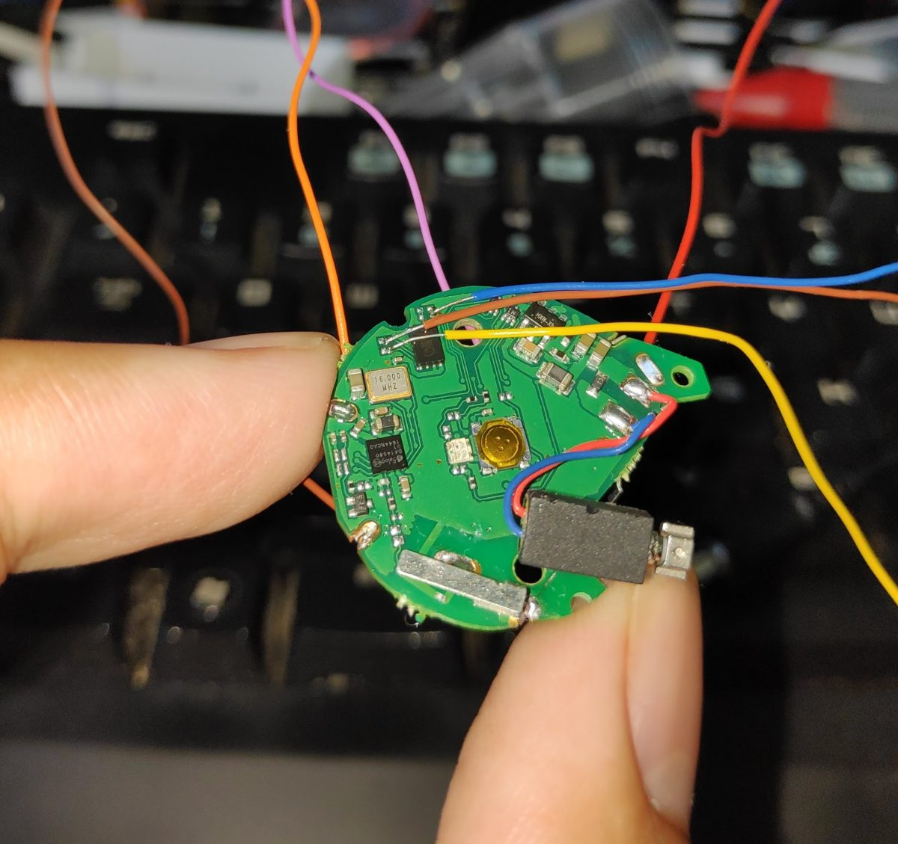

---
# Hex Editor

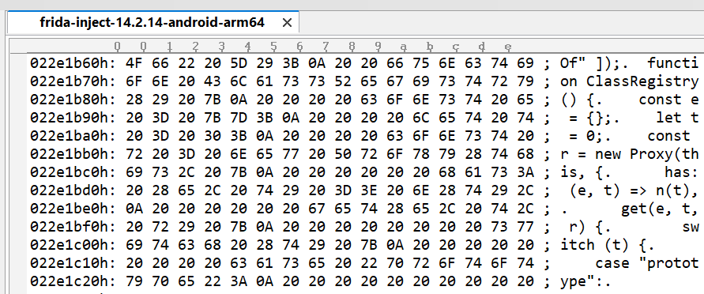

- Untuk Aplikasi yang sangat sederhana, sudah cukup untuk membongkar program
- Kita melihat representasi heksadesimal dan string-string yang terbaca
- Apa yang dicari: string yang tidak biasa (kemungkinan password), URL, email

--- 
# Disassembler

Membaca kode biner dan menampilkan sebagai assembly

Assembly tergantung arsitektur CPU (Intel, Arm, RISC-V, PowerPC, MIPS, Loongson, dsb)

Kode sederhana dan kecil bisa dibaca, tapi kode kompleks akan sulit dibaca

--- 

# Disassembler

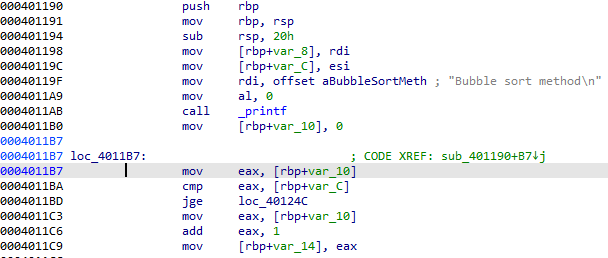

---
# Decompiler

Mengembalikan kode sebisa mungkin ke high-level language.

Dalam kode yang dirilis, nama fungsi, variabel, dsb tidak semua bisa direkonstruksi.

Perlu campur tangan manual agar benar-benar terbaca.

Agar terbayang, akan saya berikan contoh seperti apa RE sebuah fungsi sangat sederhana.

---
# Source asli

```c
static void bubble_sort(int *numbers, int count)
{
        printf("Bubble sort method\n");
        int i,j;
        for (i = 0; i < count; i++) {
                for (j=i+1; j < count; j++) {
                        if (numbers[i] > numbers[j]) {
                                int tmp = numbers[i];
                                numbers[i] = numbers[j];
                                numbers[j] = tmp;
                        }                 
                }
        }
}
```
--- 
# Hasil dekompilasi (mentah)

```c
void FUN_00401190(long param_1,int param_2)
{
  undefined4 uVar1;
  int local_1c;
  int local_18;
  
  printf("Bubble sort method\n");
  for (local_18 = 0; local_1c = local_18, local_18 < param_2; local_18 = local_18 + 1) {
    while (local_1c = local_1c + 1, local_1c < param_2) {
      if (*(int *)(param_1 + (long)local_1c * 4) < *(int *)(param_1 + (long)local_18 * 4)) {
        uVar1 = *(undefined4 *)(param_1 + (long)local_18 * 4);
        *(undefined4 *)(param_1 + (long)local_18 * 4) =
             *(undefined4 *)(param_1 + (long)local_1c * 4);
        *(undefined4 *)(param_1 + (long)local_1c * 4) = uVar1;
      }
    }
  }
  return;
}
```
--- 
# Rename function

Kita tahu dari string `Bubble sort method`, bahwa ini adalah bubble sort

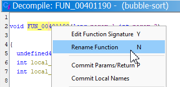

--- 
# Retype Variable

Berdasarkan pengetahuan bagaimana pointer di C bekerja, operasi yang dilakukan adalah array dengan elemen berukuran 4 byte (jadi kita gunakan `int*`).

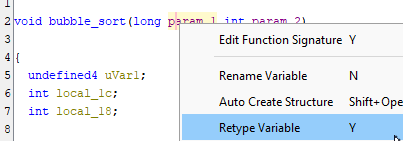

---
# Sekarang fungsi mulai terbaca

```C
void bubble_sort(int *param_1,int param_2)
{
  int iVar1;
  int local_1c;
  int local_18;
  
  printf("Bubble sort method\n");
  for (local_18 = 0; local_1c = local_18, local_18 < param_2; local_18 = local_18 + 1) {
    while (local_1c = local_1c + 1, local_1c < param_2) {
      if (param_1[local_1c] < param_1[local_18]) {
        iVar1 = param_1[local_18];
        param_1[local_18] = param_1[local_1c];
        param_1[local_1c] = iVar1;
      }
    }
  }
  return;
}
```
---
# Rename variabel-variabel lain

- indeks array adalah `i` dan `j`
- temporary tipenya adalah `int`
- perhatikan bahwa loop `for` yang kedua tetap dikenali sebagai `while` (dan ekivalen dengan source aslinya)

--- 
# Hasil akhir
```c
void bubble_sort(int *array,int count)
{
  int j;
  int i;
  int temp;
  
  printf("Bubble sort method\n");
  for (i = 0; j = i, i < count; i = i + 1) {
    while (j = j + 1, j < count) {
      if (array[j] < array[i]) {
        temp = array[i];
        array[i] = array[j];
        array[j] = temp;
      }
    }
  }
  return;
}
```

---
# Source code

- Mendapatkan source code hanya satu langkah saja, memahami kode adalah langkah yang lebih sulit
- Sudah banyak software di github, tapi berapa banyak programmer yang bisa paham?
- Contoh lain: Kernel Linux juga sudah terbuka source codenya bahkan ada banyak buku yang menjelaskan tiap komponennya, apakah bisa dimengerti kebanyakan programmer?
- memahami kode bisa butuh waktu berjam-jam, berhari-hari, dan bahkan berbulan-bulan
---
# Bahasa lain

Berbagai teknologi punya decompilernya masing-masing

Contoh: Android dengan JADX-GUI

.NET memiliki beberapa decompiler

---

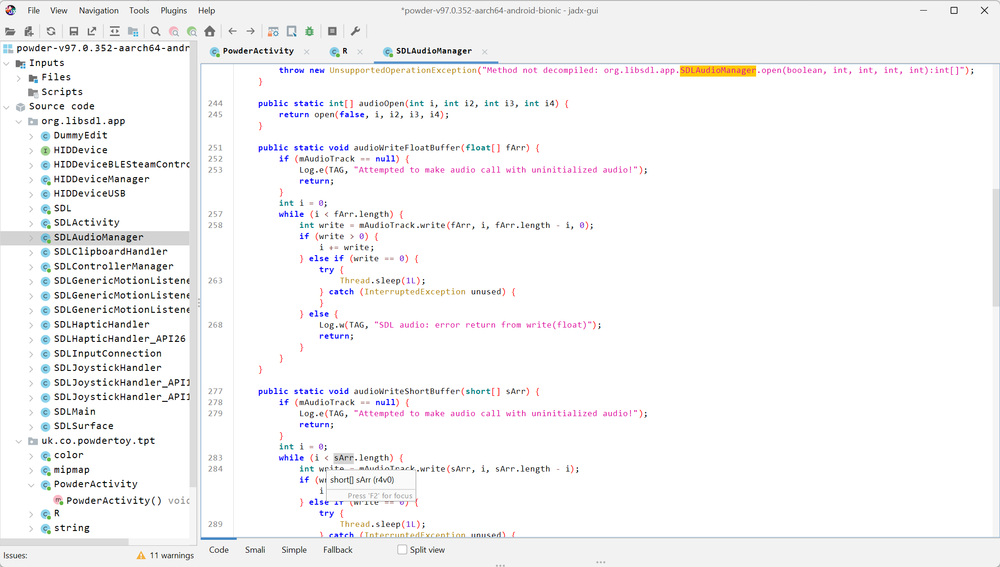

---
# Tidak selalu bisa ideal

Dalam contoh di atas, fungsi hampir kembali 99% seperti semula, namun ini jarang terjadi:

- Tidak selalu ada string yang bisa membantu kita menebak nama fungsi
- Optimasi compiler bisa menggabung banyak fungsi menjadi satu
- Programmer membuat kode yang aneh/tidak efisien sehingga sulit dimengerti
- Tool obfuscator digunakan untuk membuat fungsi sulit dipahami
---
# Obfuscated

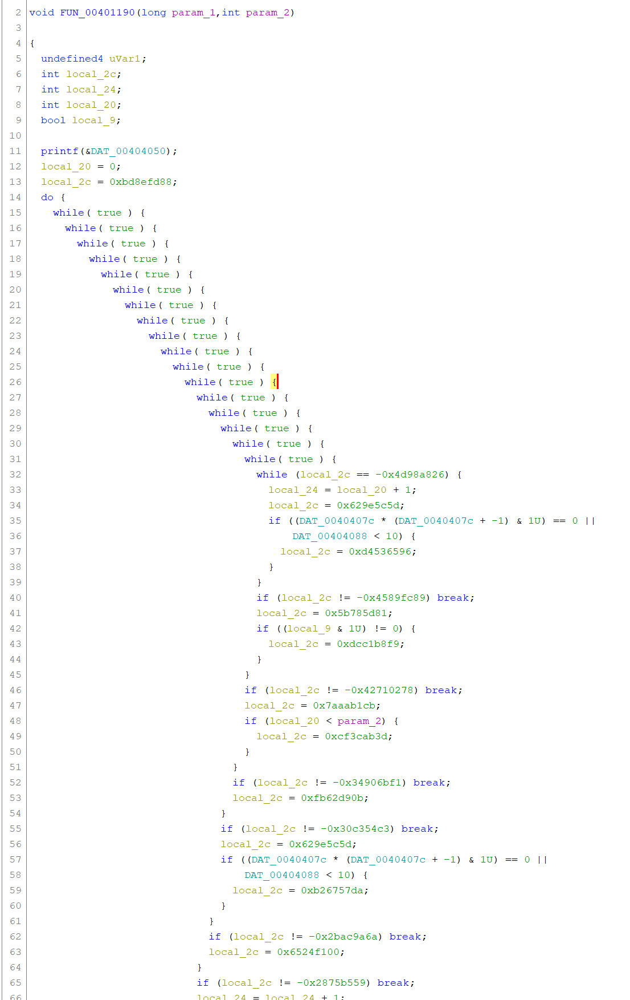

---

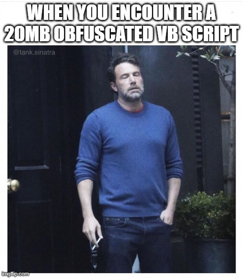
<!-- footer: '' -->

--- 

# Ransomware dan RE
<!-- footer: 'Yohanes Nugroho - 2024 - https://creativecommons.org/licenses/by-sa/4.0/' -->

Versi awal ransomware banyak memiliki bug, dengan RE bisa dicari keynya (atau kelemahan ketika menghasilkan keynya).

Saat ini ransomware semakin bagus, kebanyakan tidak memiliki kelemahan lagi

Ada ransomware pemula yang masih salah dalam implementasi enkripsi, sehingga bisa ditangani dengan melakukan RE .

--- 

# Malware dan RE

Dengan RE, kita bisa mengetahui:

- Eksploit apa yang digunakan oleh malware (jika ada)
- Kemungkinan asal malware (jika pembuatnya tidak teliti)
- Bagaimana melakukan aksi defensif (misalnya dengan mengetahui bagaimana malware manargetkan suatu sistem, kita bisa memblok aksesnya)

Contoh kasus: Stuxnet yang menargetkan PLC (programmable logic controller)

--- 

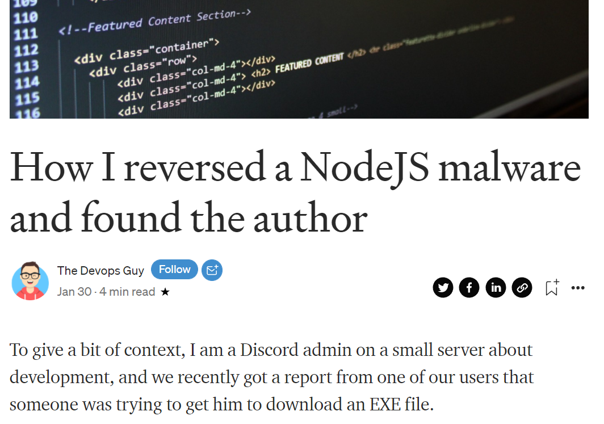
<!-- footer: '[itnext.io](https://itnext.io/how-i-reversed-a-nodejs-malware-and-found-the-author-7dd9531b389f)' -->


--- 
# Contoh kisah RE
<!-- footer: 'Yohanes Nugroho - 2024 - https://creativecommons.org/licenses/by-sa/4.0/' -->

Ini tentang Aplikasi pembaca buku/majalah Indonesia untuk iOS (saat ini aplikasinya sudah tidak ada lagi)

- Banyak orang tidak mau membeli atau sharing account
- Banyak yang ingin membajak/mengcopy PDF majalahnya

Mari kita lihat perkembangan aplikasi dan securitynya, supaya bisa melihat peran RE dalam membongkar (dan juga mengamankan) sebuah aplikasi.

--- 
# Contoh kisah RE: Level 0

Dulu ketika dilaunch, aplikasi memakai In App Purchase (IAP) tapi caranya tidak aman (tidak mengecek server). 

Di device yang dijailbreak, bisa mendownload semua majalah gratis dengan menginstall program yang akan memberitahu bahwa "pembelian sukses".

Di level ini sekedar coba-coba melihat behavior program.

Ini sekedar blackbox RE, atau bahkan bisa dianggap tidak perlu RE.

--- 
# Contoh kisah RE: Level 1

Aplikasi diperbaiki:  Pengecekan IAP di server (tidak bisa download jika tidak membeli).

- Format file majalah adalah PDF yang dienkrip (enkripsi standard PDF)
- PDF didownload aplikasi dengan password statik, sama untuk semua majalah/ebook.
- Hex Editor cukup untuk membukanya (terlihat string passwordnya), tool RE di sini hanya hex editor.

Sekarang yang dilakukan orang: satu orang membeli majalah, lalu PDF-nya disebarkan setelah didekrip.

Semua orang bisa mendekrip dengan mudah karena passwordnya sama.

---
# Contoh kisah RE: Level 2

Perbaikan versi berikutnya:

- Password berbeda untuk tiap majalah/buku
- Password disertakan (plaintext) dalam request REST/JSON untuk konten
- Tidak memakai SSL Pinning
- Cukup memakai intercepting proxy untuk melihat JSON yang berisi password

Semakin sedikit user yang bisa mendownload dan menyebarkan majalah digitalnya. 

---
# Contoh kisah RE: Level 3

- Dalam JSON disertakan password terenkripsi, perlu didekrip oleh aplikasi
- Sekedar intercept tidak bisa (tidak tahu apa algoritma dan keynya)
- Harus melakukan RE untuk mencari algoritma dan keynya
- Kode dekrip memakai library standard, mudah diintercept dengan Frida

Di level ini, yang mau melakukan prosesnya semakin sedikit

---
# Contoh kisah RE: Level 4

Versi terakhir:

- Kode dekrip password diobfuscate, tidak mudah dibaca
- Memakai algoritma custom, sulit mencari algoritmanya
- Kode program harus dibaca seksama
- Mulai ada pembajak komersial yang menawarkan PDF berbayar dengan harga murah

Pada akhirnya aplikasi ini tutup.

---
# Pelajaran

- perlu secure software development lifecyle
- sebelum rilis, ditest menggunakan RE untuk tahu seberapa rentan aplikasinya
- produk RASP (Runtime Application Self-Protection) bisa membantu menambahkan kesulitan
  
Sebagai catatan: segala macam bentuk DRM, pasti bisa dikalahkan, misalnya user bisa memfoto layar HP-nya.


---
# Mau belajar RE?

- Belajar dasar programming supaya tahu algoritma dasar
- Bahasa/teknologi apa yang perlu dipelajari?
  - Tergantung pada apa yang mau direverse engineer
  - Tidak bisa memilih (misalnya: tidak bisa meminta malware developer untuk tidak memakai Go)

---
# Latihan
<!-- footer: 'Copyright &copy; 2011-2024 [Sarah Andersen](https://sarahcandersen.com/post/168749352296)' -->


---
# Tool vs Skill
<!-- footer: 'Yohanes Nugroho - 2024 - https://creativecommons.org/licenses/by-sa/4.0/' -->


- Mengajari mengetik dengan Word bisa dilakukan dalam hitungan jam
- Tapi mengajari orang jadi penulis buku/novel butuh waktu bertahun-tahun

---
# Buku RE

Kebanyakan buku cepat ketinggalan jaman, tapi ilmu dasarnya tetap terpakai

- Practical Reverse Engineering: X86, X64, ARM, Windows Kernel, Reversing Tools, and Obfuscation
- Practical Malware Analysis: The Hands-On Guide to Dissecting Malicious Software
- The Ghidra Book: The Definitive Guide / The IDA Pro Book, 2nd Edition

---
# Online Course

https://www.udemy.com/topic/reverse-engineering/

https://www.sans.org/cyber-security-courses/reverse-engineering-malware-malware-analysis-tools-techniques/

--- 
# CTF

Banyak CTF membutuhkan RE, tantangan kategori binary exploitation butuh reverse engineering

CTF Flare-ON berfokus hanya pada RE (setahun sekali, arsip tahun-tahun sebelumnya bisa diakses)

--- 
# Masa depan Reverse Engineering di era AI

AI akan membantu reverse engineering, tapi masih cukup panjang jalannya untuk bisa otomatis memahami proteksi yang kompleks

AI juga perlu direverse engineer

--- 
# AI membantu RE

Saat ini sudah ada yang memanfaatkan AI/LLM (Large Language Model) untuk membantu menjelaskan kode hasil RE.

Masih belum bisa digunakan untuk hal yang kompleks, karena keterbatasan arsitektur LLM saat ini.

Perkembangannya untuk RE masih cukup lambat, karena contoh data untuk RE juga masih terbatas.

--- 
# Keterbatasan LLM saat ini

Berbagai model berbasis LLM seperti ChatGPT, Gemini, Claude, dsb tidak memiliki kemampuan komputasi (akan salah jika ditanya pertanyaan matematika).

Saat ini ChatGPT dan yang lain membuat lalu  mengeksekusi kode.

Reverse engineering saat ini penuh dengan persoalan komputasi (perhitungan address, aritmatika pada data, dsb)

--- 
# Melakukan reverse engineering terhadap Aplikasi berbasis AI

Banyak aplikasi akan memanfaatkan AI (AI sebagai komponennya)

Kita bisa melakukan reverse engineering untuk mengetahui apakah modelnya memang akurat, bisa mencuri modelnya, atau mencari kelemahannya (adversarial AI)

Contoh kasus: reverse engineering pengenalan digit SIREKAP

--- 
# Melakukan reverse engineering terhadap model AI

Saat ini banyak riset yang berusaha membongkar model AI, misalnya: mengetahui parameter model AI, bagaimana mengekstraksi data dari model AI.

Riset mengenenai ini masih di tahap awal.

--- 
# Penutup

RE Sangat penting untuk security

RE tidak mudah, tapi sangat menarik dan penuh tantangan

Masa depan RE masih cerah

---
# Group Reversing.ID

Group Telegram (banyak member walau agak kurang aktif)

https://t.me/ReversingID


---
# Blog

Blog pribadi saya:  https://tinyhack.com/ dan https://blog.compactbyte.com/category/reverse-engineering/

Blog hacking hardware: https://hackaday.com/blog/

Blog Ida pro: https://hex-rays.com/blog/

Security: https://revers.engineering/

Berbagai tulisan di Medium: https://medium.com/tag/reverse-engineering